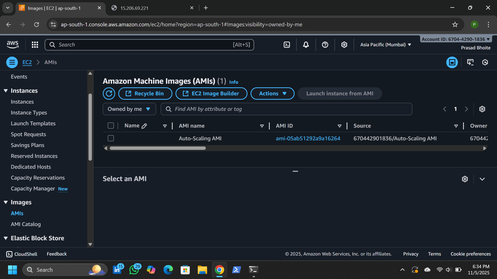

# 🌐 Manual Scaling using AWS Load Balancer (EC2 + ALB)

A **simple, powerful, and beginner-friendly** cloud project demonstrating how to **manually scale EC2 instances** and efficiently distribute traffic using an **Application Load Balancer (ALB)** on AWS.

---

## 🧭 Project Overview :-

This project shows how to **manually scale** your AWS environment by:
- Launching multiple **EC2 instances** running Nginx.
- Creating a **custom AMI (Amazon Machine Image)** to easily replicate instances.
- Configuring an **Application Load Balancer (ALB)** with a **Target Group** to evenly distribute incoming traffic.
- Testing high availability and manual scaling in real time.

---

## ⚙️ Tech Stack :-

| Component | Description |
|------------|-------------|
| **AWS EC2** | Virtual servers for hosting web apps |
| **AMI** | Custom image used for instance replication |
| **ALB (Application Load Balancer)** | Distributes traffic across instances |
| **Target Group** | Connects EC2 instances to the ALB |
| **Nginx** | Web server for serving the website |
| **Security Groups** | Control inbound/outbound traffic |

---

## 🏗️ Architecture Diagram :-

User → Application Load Balancer → Target Group → Multiple EC2 Instances (via AMI)

Each EC2 instance hosts a simple web page (via Nginx).  
The Load Balancer routes traffic between them for better performance and reliability.

---

## 🚀 Step-by-Step Setup :-

### 1️⃣ Launch Base EC2 Instance :-

- ***Go to AWS EC2 Console → Launch an instance.***

- ***Choose Amazon Ubuntu 2 AMI.***

- ***Select instance type (e.g., t2.micro).***

- ***Configure security group:***

- ***Inbound: HTTP (80), SSH (22)***

- ***Outbound: All traffic***

- ***Launch and connect via SSH.***

### 2️⃣ Install and Configure Nginx :-
```
sudo apt update -y
sudo apt install nginx -y
sudo systemctl start nginx
sudo systemctl enable nginx
echo "<h1>Welcome to Auto-Scaling server 1....!</h1>" | sudo tee /usr/share/nginx/html/index.html
Check your instance public IP in the browser — you should see the message above.

```
### 3️⃣ Create a Custom AMI :-

- ***Once your base instance is ready:***

- ***Go to EC2 → Instances → Select instance → Actions → Image → Create Image.***

- ***Give a name (e.g., My-AMI).***

- ***Wait for the AMI to be created (check under AMIs in the console).***

- ***This AMI will be used to quickly launch multiple identical EC2 instances.***

### 4️⃣ Launch More Instances from AMI :-

- ***Go to AMIs → Select your AMI → Click Launch instance from image.***

- ***Create 2–3 instances from the same AMI.***

- ***Update the Nginx message on each to differentiate them:***

- ***echo h1>Welcome to Auto-Scaling Server 2....!</h1 | sudo nano /var/www/html/index.html***
  


### 5️⃣ Create a Target Group :-

- ***Navigate to EC2 → Target Groups → Create target group.***

- ***Choose Instances as target type.***

- ***Name it My-TG.***

- ***Protocol: HTTP, Port: 80***

- ***Register your running EC2 instances under this Target Group.***


### 6️⃣ Create an Application Load Balancer (ALB) :-

- ***Go to Load Balancers → Create Load Balancer → Application Load Balancer.***

- ***Choose Internet-facing and select at least two Availability Zones.***

- ***Create or select a Security Group that allows HTTP (port 80).***

- ***Attach the Target Group you created earlier.***

- ***Once created, note the DNS name of the ALB.***

### 7️⃣ Test Manual Scaling :-

- ***Open the ALB DNS name in your browser.***

- ***Refresh the page multiple times — you’ll see responses from different EC2 instances (Instance 1, 2, etc.).***

- ***This confirms traffic load balancing.***

- ***You can manually add or remove instances in the Target Group to scale up or down.***

---

## 🐧 Linux Commands Used :-

1] Update and upgrade packages :-
```
sudo apt update -y
sudo apt upgrade -y
```
2] Install Nginx :-
```
sudo apt install nginx -y
```
3] Start and enable Nginx :-
```
sudo systemctl start nginx
sudo systemctl enable nginx
```
4] Check Nginx status :-
```
sudo systemctl status nginx
```
5] Create HTML page :-
```
echo "<h1>Welcome to Auto-Scaling Server 1....!</h1>" | sudo tee /usr/share/nginx/html/index.html
```
6] Connect to EC2 via SSH :-
```
ssh -i your-key.pem ubuntu@ec2-public-ip
```
7] Check Ubuntu version :-
```
lsb_release -a
```
8] Terminate instances (after testing) :-
```
aws ec2 terminate-instances --instance-ids <instance-id>
```
## 📋 Deployment Checklist :-

 - Base EC2 launched and Nginx installed

 - Custom AMI created

 - Additional EC2 instances launched from AMI

 - Target Group created and instances registered

 - Application Load Balancer configured

 - ALB tested for manual scaling and traffic distribution

 - Security groups verified

- Extra instances terminated to avoid costs

## 🧠 Key Learnings :-

✅ How to manually scale EC2 instances using a custom AMI

✅ How to configure an Application Load Balancer and Target Group

✅ How to ensure high availability across multiple instances

✅ How to test and verify traffic distribution

## 🖥️ Future Enhancements :-

- Automate scaling with AWS Auto Scaling Groups

- Add HTTPS/SSL support on ALB

- Integrate CloudWatch for monitoring traffic and performance

- Deploy a dynamic web app instead of static HTML

- Add multi-region deployment for global availability

## 📸 Folder Structure :-
``` 
manual-scaling-project/
│
├── index.html        # Nginx page for instance 1
├── images/           # Screenshots for setup
└── README.md         # Project documentation
```

## 🔒 Security Tips :-

- Restrict SSH access to your IP only

- Use separate security groups for ALB and EC2

- Terminate extra instances after testing to avoid extra costs

## 🧩 Use Cases :-

- AWS Learning and Practice Project

- Demonstration of Manual Scaling Concept

- Portfolio or Resume Project for Cloud/DevOps Roles

## 📸 Screenshots

Below are some important screenshots of the project:

| My-AMI | Load-Balancer |
|------------------|-------------------|
|  | 
| Instance | Target-Group |
|  | 

### 🎥 Output Video

<video src="./Images/Result OF ALB.mp4" width="600" controls></video>


> 📝 *Tip:* Create a folder named **`Images/`** in your repo and upload all your images there.  


## 🧑‍💻 Author :-

Prasad

📘 Project Type: AWS Cloud | Manual Scaling Architecture

🗓️ Version: 1.0

📜 License: MIT

----
## 📩 Connect With Me

If you’d like to collaborate, discuss projects, or just say hello — feel free to reach out!  

### 🔗 Social & Professional Links
- 🌐 [Portfolio Website](https://prasad-bhoite19.github.io/prasad-portfolio/)  
- 💼 [LinkedIn](http://linkedin.com/in/prasad-bhoite-a38a64223)  
- 🐙 [GitHub](https://github.com/Prasad-bhoite19)  
- ✉️ [Email](prasadsb2002@gmail.com)  

💬 Always open for opportunities in **Cloud, DevOps, and Full-Stack Projects**
